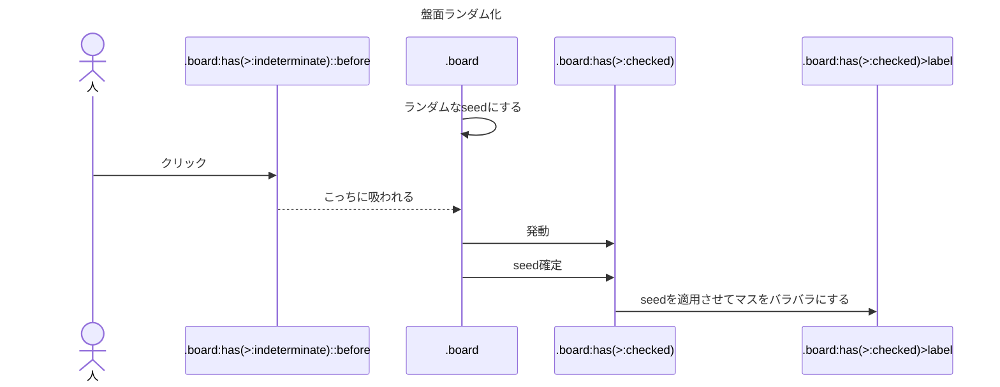
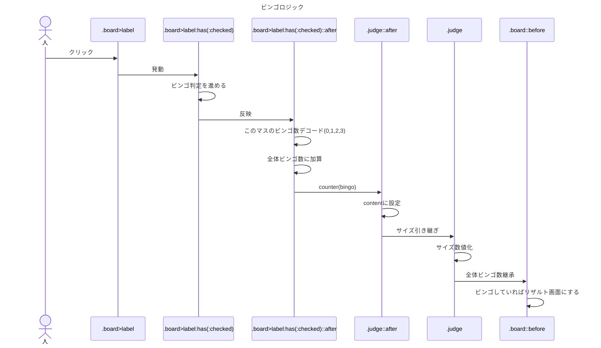

# ビンゴ
HTMLとCSSで作ったビンゴです。

## 実際に遊べるページ
https://surahotoke.github.io/Bingo

## プレイ動画

## 遊び方
1. はじめにビンゴ領域のどこかをクリックすると、毎回ランダムに配置されます。  
（この際、1~25のうちどれか1つの数字がFREEに置き換わります）
2. その後、好きなマスを押せるようになります。
3. ビンゴすると、その結果（ビンゴ / ダブルビンゴ / トリプルビンゴ）が表示されて操作できなくなり、ゲーム終了となります。

※ 空けるセル番号の表示は本実装とは異なる仕組みで行われるものとします。
## 対応ブラウザ・注意点
- 最新のChromeブラウザを推奨しています。Chrome / Edge / Operaで動作することを確認しました。（Firefox, Safariでは動作しませんでした）
- 稀に処理落ちにより、`エラー コード: 5`が表示されることがあるかもしれません。再読み込みで解消します。

## 構成ファイル
- `index.html`（25行）
- `style.css`（100行）
- `script.css`（185行 / うちアットルール90行）

## 仕組み

## 自作乱数の精度の検証
Pythonを使って自作乱数の精度の検証を行いました。（こちらはAIに任せた）  
https://github.com/surahotoke/css-randomness-test

## 更新履歴
- 2025/01/07：初コミット